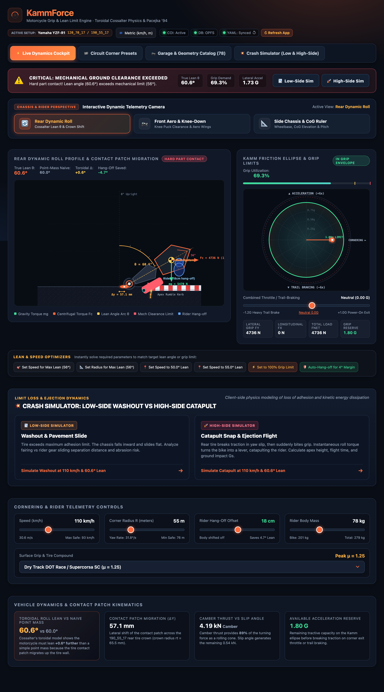
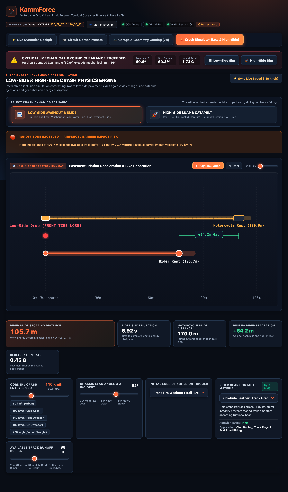
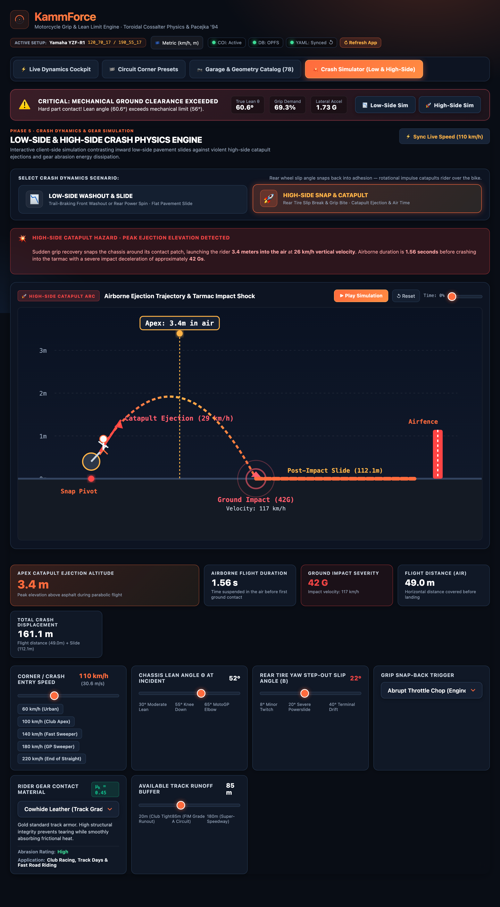
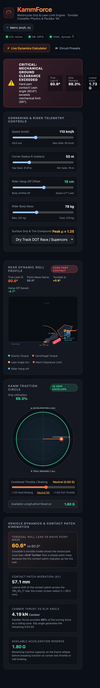

# KammForce

Offline-first, serverless PWA for motorcycle grip and lean-limit calculations
(toroidal tire roll equation + Pacejka '94 with camber thrust).

- **Hosting:** GitHub Pages (static, no backend)
- **Database:** `@sqlite.org/sqlite-wasm` + OPFS inside a Web Worker, hydrated from YAML in `public/data/`
- **Cross-origin isolation:** custom service worker (`src/sw.ts`) adds COOP/COEP headers (GitHub Pages can't)
- **Data pipeline:** `scraper/scraper.py` (aiohttp + BeautifulSoup + OpenCV CoG), run weekly by `.github/workflows/scraper.yml`

**Live:** https://franekjemiolo.github.io/kammforce/

## Screenshots

<p align="center">
  
  
</p>
<p align="center">
  
  
</p>

Regenerate them after UI changes (builds the app, serves it, captures with Playwright):

```bash
npx playwright install chromium   # first time only
npm run screenshots
```

## Development

```bash
npm ci
npm run dev        # dev server sends COOP/COEP headers itself
npm run build      # typecheck + production build

pip install -r scraper/requirements.txt
python scraper/scraper.py --targets scraper/targets.yaml --output public/data
```

## Roadmap & Status

1. ✅ **Phase 1: Data Pipeline** (`scraper.py` async scraper with OpenCV CoG mask, YAML schema, scheduled GitHub Action).
2. ✅ **Phase 2: Frontend & Wasm Database** (Vite PWA, `@sqlite.org/sqlite-wasm` inside Web Worker with OPFS, custom COOP/COEP isolation SW, localForage IndexedDB garage).
3. ✅ **Phase 3: Physics Engine** (Newton-Raphson transcendental toroidal solver, Pacejka '94 Magic Formula + Camber Thrust cone model, 2D rider hang-off kinematics, 20/20 Vitest tests).
4. ✅ **Phase 4: UI & Visualizations** (Real-time SVG Dynamic Roll Profile with contact patch migration, Kamm Traction Circle ellipse with trail-braking/throttle slider, famous track corner presets, multi-unit toggles, shareable URL hash).
5. ✅ **Phase 5: Crash Kinematics & Gear Simulation (Low-Side & High-Side Dynamics)** (Work-Energy Theorem low-side stopping distance & duration, dual bike vs rider fairing separation runway, High-Side roll impulse snap catapult ejection flight arc $h_{apex}$ and airborne duration, ground impact severity G-shock, kinetic friction $\mu_k$ catalog for Kangaroo/Cowhide/Cordura/Kevlar/Denim/Sliders, rotational tumble risk predictor for $\mu_k > 0.6$, synthetic melt-through thermal warnings, interactive asphalt/gravel runoff buffer runway, 20/20 Vitest tests).

## Physics & Equations

- **Toroidal Roll Equation (Cossalter):**
  $$mg(h - r_t)\sin\theta = m\frac{v^2}{R}[r_t + (h - r_t)\cos\theta]$$
  Solved dynamically via Newton-Raphson. Accounts for the migrating tire contact patch ($\Delta y = r_t \sin\theta$).
- **Pacejka '94 + Camber Thrust ($C_\gamma$):**
  $$F_y = F_{y,\alpha} + F_{y,\gamma}$$
  Motorcycle tires act like rolling cones, with camber thrust providing 60–85% of total cornering force.
- **Rider Hang-off Kinematics:**
  Recalculates combined system Center of Gravity $(h_{eff}, y_{offset})$ to show real-world lean angle savings (saving 3°–6° of bike lean).
- **Kamm Traction Ellipse:**
  $$\left(\frac{F_x}{\mu_x F_z}\right)^2 + \left(\frac{F_y}{\mu_y F_z}\right)^2 \le 1$$
  Calculates available longitudinal braking/acceleration reserve while leaned over.
- **Low-Side Crash Kinematics (Work-Energy Theorem & Fairing Separation):**
  $$d_{slide} = \frac{v^2}{2 \mu_k g}, \quad t_{slide} = \frac{v}{\mu_k g}, \quad \Delta d = d_{bike} - d_{rider}$$
  Because motorcycle fairings have lower kinetic friction ($\mu \approx 0.28$) than rider leather gear ($\mu_k \approx 0.45$), the motorcycle separates from the rider by $\Delta d = 15\text{m} - 65\text{m}$ during a slide.
- **High-Side Catapult Ejection & Parabolic Flight:**
  $$v_{launch} = \omega_{snap} \cdot h_{cog}, \quad h_{apex} = h_{seat} + \frac{v_y^2}{2g}, \quad t_{flight} = \frac{v_y + \sqrt{v_y^2 + 2 g h_{seat}}}{g}$$
  When a sliding rear tire abruptly regains traction, angular impulse catapults the rider over the top with vertical launch velocities reaching 20–35 km/h, propelling the rider to apex altitudes of 2–3.5 meters before severe ground impact shock (15–45 Gs).
- **Rotational Tumble Risk:**
  When $\mu_k > 0.60$ (such as street denim $\mu_k = 0.70$), high friction snags pavement aggregate, converting a controlled flat slide into violent rotational tumble torque that drastically increases bone fracture and joint dislocation risk.

